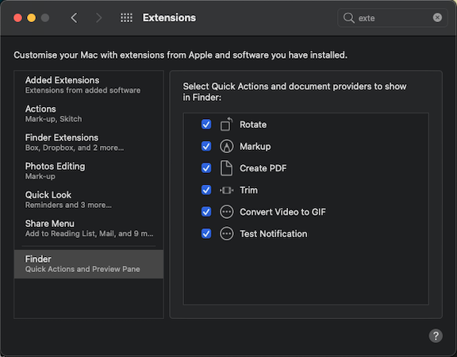
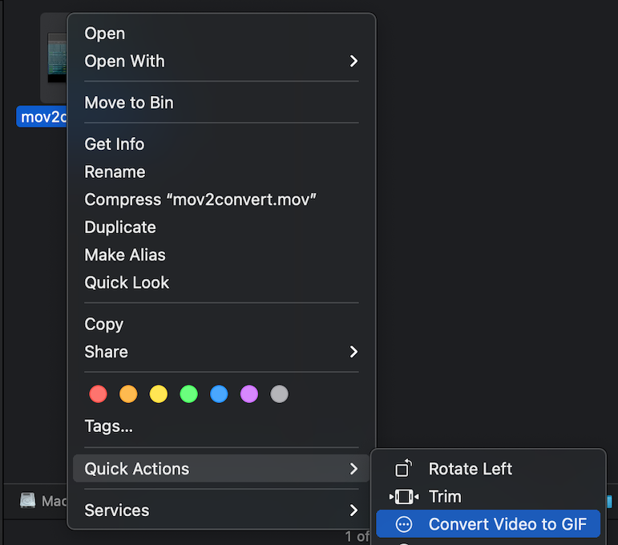
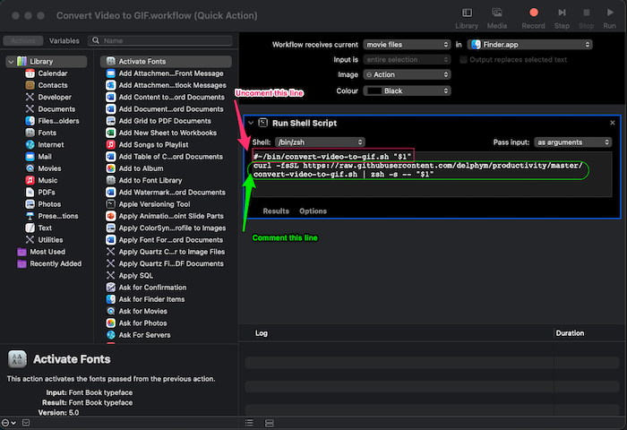

# Convert Video to GIF

Sometimes you need to convert a video like a screen recording to a high-quality GIF file. This is the tool to do that on macOS.

It is particularly useful when you want to add a screen recording to your Pull Request or issue while the platform only allows images like Bitbucket.
It uses the best settings to keep the GIF file size as small as possible since some platforms have a very low size limit for image files. It also maintains a good quality while reducing the framerate.

You can check a [demo GIF there](https://github.com/friedrith/productivity/assets/4005226/e752691e-03d9-4a2e-9232-71f814e56b3c).

## Getting started

The tool uses [`ffmpeg`](https://ffmpeg.org/) to extract the video frames and [`ImageMagick`](https://imagemagick.org/) to convert the frames to a GIF file.

```bash
brew install ffmpeg imagemagick

# if you are using macOS silicon
arch -arm64 brew install ffmpeg imagemagick
```

## Installation
This tool is available as an [Apple shortcut](#apple-shortcut). Alternatively, as [Apple Automator Workflow](#apple-automator-workflow), if **Shortcut** won't work on your Mac for some reason.

### Apple Shortcut
This is a <ins>recommended</ins> way of installing this tool on your Mac – as an **Apple shortcut**.
You can install it from the link below:

[https://www.icloud.com/shortcuts/db18892750f3453c83d57281915be17f](https://www.icloud.com/shortcuts/db18892750f3453c83d57281915be17f)

Then you will be able to convert a video to a GIF file from the context menu on the Finder app, as shown in Figure below.

<details>
  <summary>expand to see the figure</summary>

  
</details>

### Apple Automator Workflow
This is an <ins>alternative</ins> way of installing this tool on your Mac - as an **Automator Workflow**. It requires more setup to do, but it could be a fallback installation process if **Apple Shortcuts** is not available on your Mac (i.e. unsupported version).
You can import it to your **Automator** from the
[`/assets/Convert Video to GIF.workflow`](./assets/Convert%20Video%20to%20GIF.workflow/)
directory in this repo as **Quick Actions**.

<details>
  <summary>expand to see the instructions</summary>

  #### Instructions how to import the workflow
  1. Download the `.workflow` directory:
  2. Move the Workflow to the Services Folder:<br>
     To access this directory, they can:
     - Open Finder.
     - Press `Command + Shift + G` and type `~/Library/Services/`.
  3. Enable the Quick Action:
     - Go to `System Preferences` > `Extensions` > `Finder Extensions` or `Services`.
     - Ensure the new workflow is enabled in the list<br>
      
  #### 4. Use the Quick Action:
  - The workflow will now be available in the Finder’s right-click `Quick Actions` menu for any compatible files.
</details><br>

Then you will be able to convert a video to a GIF file from the context menu on the Finder app.
<details>
  <summary>expand to see the Quick Action context menu figure</summary>

  
</details>

### Script

You can also run the script directly:

```bash
curl -fsSL https://raw.githubusercontent.com/delphym/productivity/master/convert-video-to-gif.sh | zsh -s -- <video-2-convert.mov>
```

Or you just download it, place it somewhere like `~/bin/`, make it executable `chmod +x ~/bin/convert-video-to-gif.sh` and then you can run it from CLI:
```bash
~/bin/convert-video-to-gif.sh <video-2-convert.mov>
```
Having that script locally gives you an ability to modify the conversation key parameters inside the script.

If you'd like to use the advantages of using a local script for the contextual menu from the Finder, you'd need to update the workflow in Automator
<details>
  <summary>As indicated on the figure:</summary>

  
</details>